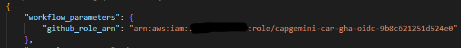
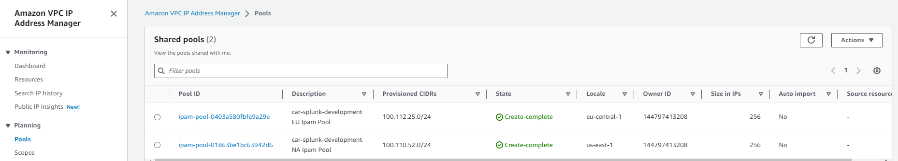

# Documentation

## Overview

This repository contains tools and scripts to deploy and configure infrastructure for Splunk application. Final build comprises of a distributed topology of Splunk with various application components, the solution builds the infrastructure and configures it to a production ready state. The solution requires certain prerequisites to be met for it to be successfully deployed in a target EAF AWS Account.
Following are the components of the technology stack used.
1.	Terraform
2.	Python
3.	Ansible
4.	Bash
5.	GitHub Actions

On a high level, the automation is driven by user input via a deployment menu and an input JSON file. The whole process can be divided into the following steps.

1. Creation of the network stack done via terraform
2. Creation of the infrastructure stack done via terraform
3. Configuration of the infrastructure components via Ansible
 
## Input JSON

Navigate to folder `EAF-Splunk/scripts/json_configuration`, read the `README.md` file and follow the instructions. Please be aware that understanding of the input JSON file is critical and the documentation clearly outlines the schema in which the input is expected.

## Pre-requisites 

The solution is designed keeping in mind the EAF AWS project, so almost all the pre-requisites mentioned below are a part of an account provisioning in EAF and shall be met by default.

1.  IAM role :  The automation consumes an IAM role which leverages OpenID Connect authentication against the  EAF AWS SSO to get time bound session/credentials. The role is created during    the target account provisioning by EAF Platform support team. The role has all required policies associated with it for executing the automation and it comes with a session duration of 3 hours
                      
 Example of a role:  `capgemini-car-gha-oidc-9b8c621251d524e0`

** The operator deploying the solution needs to check the IAM in the target account to identify the role, the ARN of the role is required as an input in the input JSON file      
                           
   

2.  S3 Bucket: The solution utilizes an S3 bucket to store Terraform state. By default, the account provisioning process in EAF creates a bucket for the same. So, if the solution is being deployed in an EAF AWS account bearing account number `9999977777` in the `us-east-1` AWS region, then the S3 bucket `terraform-state-9999977777-us-east-1` (**terraform-state-ACCOUNTNUMBER-AWSREGION**) must exist, and it will be used to store terraform state.

3. DynamoDB Table:  The solution utilizes AWS DynamoDB for terraform state locking to prevent concurrent runs on a project. By default, the account provisioning process in EAF creates a DynamoDB Table for the same. So, if the solution is being deployed in an EAF AWS account bearing account number `9999977777` in the `us-east-1` AWS region, then the DynamoDB table `terraform-state-lock-9999977777-us-east-1` (**terraform-state-lock-ACCOUNTNUMBER-AWSREGION**) must exist, and it will be used for terraform state locking.

4. IPAM pool:  The solution expects the target account to have IPAM pools available in the region the solution must be deployed. Again, as per the standard AWS account provisioning in EAF, the target accounts have shared IPAM pools which are region specific. The solution consumes the network address provided by the shared IPAM pool in the respective region of deployment in target account to build the network via terraform.

5. IAM Policy: As per EAF standards the SSM session has to be encypted via a KMS key. The KMS key and the IAM policy with the relevant authorization is pushed to the target account during
   the standard AWS account provisioning in EAF. As mentioned below in the Solution enablers section, the pipeline creates an SSM IAM role utilizing the aformentioned IAM policy.
   The name of the IAM policy is **`session-manager-encrypted-connect`**. Existence of the IAM policy in the target account has to be validated before the deployment.

***Note : The operator deploying the solution has to ensure the above pre-requisites are met by checking the existence of the above resources in the target AWS account/region. This has to be done before the pipeline is executed and any deviation shall be reported to the EAF Platform support team.***

## Manual prerequisites

1. Create variables in GitHub Secrets containing Splunk license. [Manual]
   1. Name of variables must be `LICENSE_E24` and `LICENSE_I24` and provide correct license for each of them.

***Note: This will be an optional pre-requisite in the future, for now it has to be done and the Licenses will be provided by the Product team.***

## Limitations

1. The solution as of now only supports the following AWS regions, which is inline with the regions supported by EAF

    1. eu-central-1
    2. eu-west-2
    3. us-east-1

## Solution Enablers

The current solution is an enhanced version of the initial solution developed by CIS. We have introduced automation to solution certain steps which were manual in the previous release. The following information is for the awareness of the teams deploying the solution.

1. IAM Role for SSM: The solution creates an IAM role, the naming standard is as follows.
   
   RoleName: `eaf-instance-ssm-region-role`

**`eaf-instance-ssm-us-role`** will be a role created when the deployment is done in AWS us-east-1 region

       1. eaf-instance-ssm-us-role  --> us-east-1 region
       2. eaf-instance-ssm-uk-role  --> eu-west-2 region
       3. eaf-instance-ssm-eu-role  --> eu-central-1 region

The role comprises of all the required policies for it to be consumed for SSM console access and for ansible execution.

2. S3 Bucket:  The solution creates an S3 bucket in the same region as the deployment, this bucket is used for storing the Splunk install binaries, configuration and the bucket is also used in ansible configuration to facilitate
   SSM based access to ansible. The naming convention followed for the bucket is **`eaf-splunk-binaries-ACCOUNTNUMBER-AWSREGION`**, an example would be 
   eaf-splunk-binaries-858165505743-eu-central-1. The pipeline creates the bucket and uploads the Splunk configuration/binaries to the bucket as follows.

      1. /splunk/binary/splunk-9.1.1-64e843ea36b1.x86_64.rpm (should be avaiable at vendor site)
      2. /splunk/deploymentServer/default_app/v1/inputs.conf (taken from provided documentation or at vendor site)

***Note: The RPM is downloaded from the vendor site and the input.conf exists in the repository.***

Late stage of the pipeline also uses the S3 bucket as a transit point to copy from and to the Splunk application configuration.

      1. /SA-IndexCreation/
      2. /SA-ITSI-Licensechecker/
      3. /SA-UserAccess/
      4. /Splunk user admin.txt
3. python code :

**Script for AWS Resource Tag Checker:**
 
- Checks AWS resources (S3 bucket, DynamoDB table, managed IPAM pools) and exits with an error if any check fails.
- Utilizes a class (`AWSResourceTagChecker`) to check tags on EC2 instances, VPCs, Subnets, and ALBs, providing a summary of results.
 
**Script for S3 Bucket Creation and File Operations:**
 
- Manages local and S3 paths, creates bucket policies, and handles S3 operations including uploads and updates.
- Ensures the existence of an S3 bucket, local directory, and performs file checks and uploads, updating a GitHub environment file.
 
**Script for Creating tfvars JSON File:**
 
- Parses command-line arguments, loads configurations, and generates unique names for instances.
- Configures volumes, load balancer parameters, and constructs a tfvars file for Terraform.
- Outputs a tfvars file containing Terraform configuration details.
 
**Script for Updating JSON:**
 
- Updates Terraform JSON data, collects subnet and security group information, and maps worker types to resources.
- Saves the updated JSON data and repairs it if necessary, writing the result to an output file.

:bulb: ***Note: For more detailed information, please refer to the <ins> README.md </ins> file located in the <ins> scripts/create_architecture </ins> directory.***

 ## Usage

 Assuming all the Pre-requisites and the operator has created the input JSON file, commited the file to the repo or is ready to pass it as an 
 input to the deployment, the deployment process can be initiated. 

 :bulb: ***Note: For more detailed information on deployment howto, please refer to the <ins> README.md </ins> file located in the <ins> scripts/howto </ins> directory.***