# Description

**READ CAREFULLY** This folder contains a PowerShell script that deploys a CloudFormation stack using a specified template. The script is used to deploy the CloudFormation stack that creates the GitHub role in the designated account. You can either use this script or the AWS Management Console to deploy the stack.

This PowerShell script creates a CloudFormation stack using a specified template and waits for the stack creation to complete before retrieving the stack outputs. The script first checks if the necessary environment variables for AWS CLI are set and configures the AWS CLI using these variables. It then validates the CloudFormation template and creates a stack using the specified template and parameters. The script checks the stack status repeatedly until it reaches the desired status or fails, and then retrieves the stack outputs if the stack creation is successful.

The script accepts three optional parameters: stackName, maxRetries, and retryIntervalSeconds, which allow you to customize the script's behavior. The stackName parameter allows you to specify a custom name for the CloudFormation stack, while maxRetries and retryIntervalSeconds control the number of times the script checks the stack status and the interval between each check, respectively. If these parameters are not specified, default values will be used.

If the stack creation fails, the script will delete the failed stack and wait for the deletion to complete before exiting with a non-zero status code.

## Script usage

Set the required environment variables for AWS CLI: AWS_ACCESS_KEY_ID, AWS_SECRET_ACCESS_KEY, AWS_SESSION_TOKEN, AWS_DEFAULT_REGION. Make sure these variables are set before running the script.

### Example:

Powershell

```powershell
$env:AWS_ACCESS_KEY_ID = ''
$env:AWS_SECRET_ACCESS_KEY = ''
$env:AWS_SESSION_TOKEN = ''
$env:AWS_DEFAULT_REGION = ''
.\create-stack.ps1
```

Run the script using PowerShell: .\create-stack.ps1

The script will output the stack status and outputs to the console. If the stack creation is successful, the script will output the stack outputs.

If the stack creation fails, the script will delete the failed stack and wait for the deletion to complete before exiting with a non-zero status code.

<!-- Note: The script assumes that the CloudFormation template file is located in the same directory as the script file and named github_role.yaml. You can customize the template file name and location by updating the --template-body parameter in the aws cloudformation create-stack command. -->

## CloudFormation Deployment

In addition to using PowerShell scripts to deploy CloudFormation stacks, you can also use the AWS Management Console to deploy stacks using a CloudFormation file. Here's how to deploy a stack using the AWS Management Console and the `github_role.yaml` file:

1. Log in to the AWS Management Console

2. Navigate to the CloudFormation service.

3. Click on the "Create stack" button to start creating a new stack.

4. Select "Upload a template file" and click "Choose file". Select the `github_role.yaml` file from your local machine and click "Open".</br> 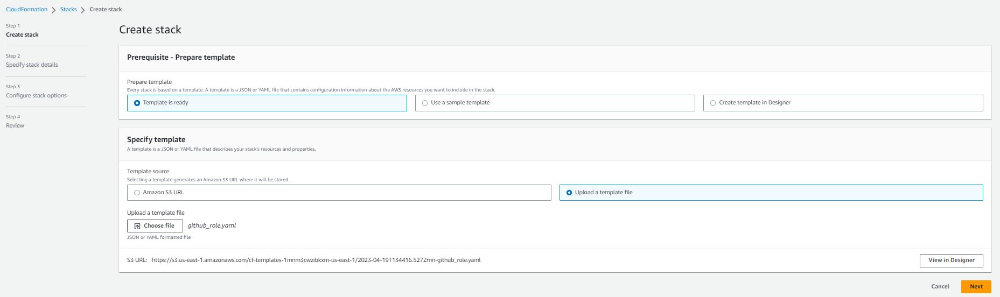

5. Click "Next" to proceed to the "Specify stack details" page.

6. Enter a stack name in the "Stack name" field.

7. Specify any additional parameters as required. The `github_role.yaml` file may include some parameters that need to be set. </br> 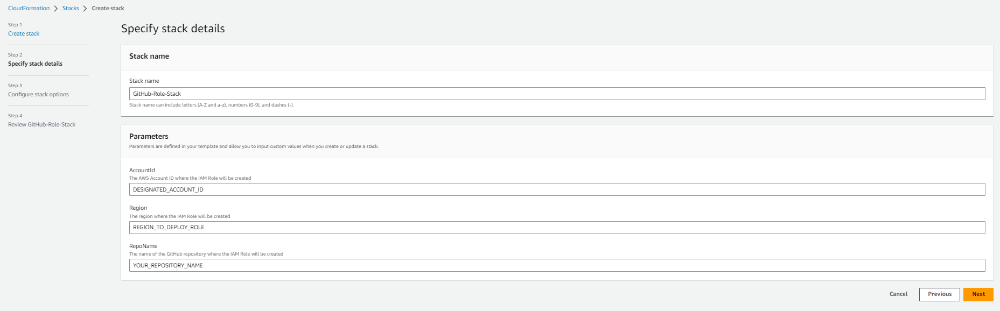

8. Example of filled parameters </br> 

9. Click "Next" to proceed to the "Configure stack options" page. You can specify additional options such as tags, termination protection, and rollbacks. You can also leave these options as default.

10. Click "Next" to proceed to the "Review" page.

11. Review the stack details and make any necessary changes. If everything looks correct, check the box next to "I acknowledge that AWS CloudFormation might create IAM resources" and click "Create stack".</br> 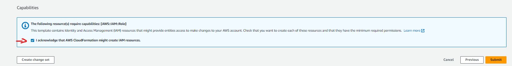

12. The stack will now be created. You can monitor the progress of the stack creation in the "Events" tab. </br> 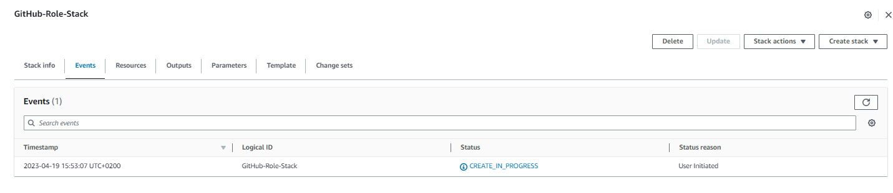 </br> 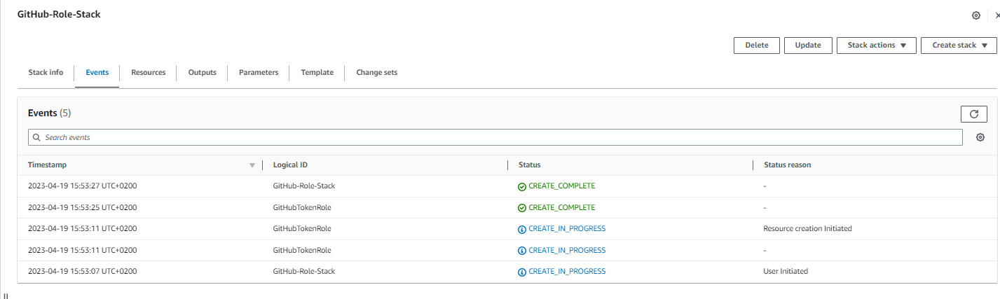

13. Once the stack creation is complete, you can view the stack outputs by selecting the stack and clicking on the "Outputs" tab. </br> 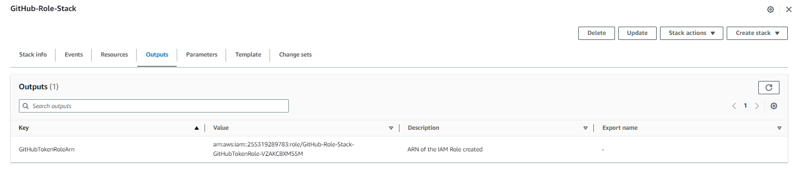

## What to do next

Save the ARN of GitHub role somewhere where you can find it later. You will need it to properly configure input JSON file.
<!-- 1. Copy the ARN from output either from the AWS console or from the script output </br> 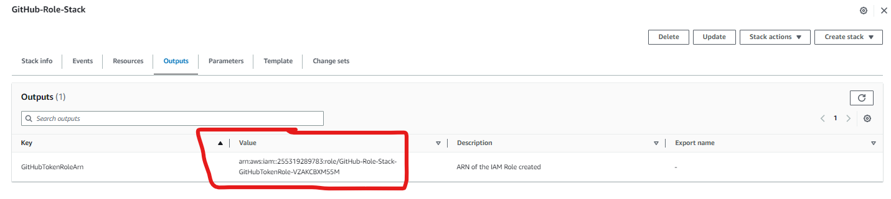 or </br> 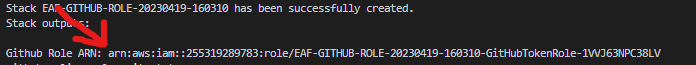 -->
<!-- 2. Paste it in GitHub Secrets as `AWS_GITHUB_ROLE_ARN`
   1. Navigate to secrets in GitHub Repository Settings
   2. Got to Secrets and variables, then to 'Actions'
   3. Press 'New repository secret' green button </br> 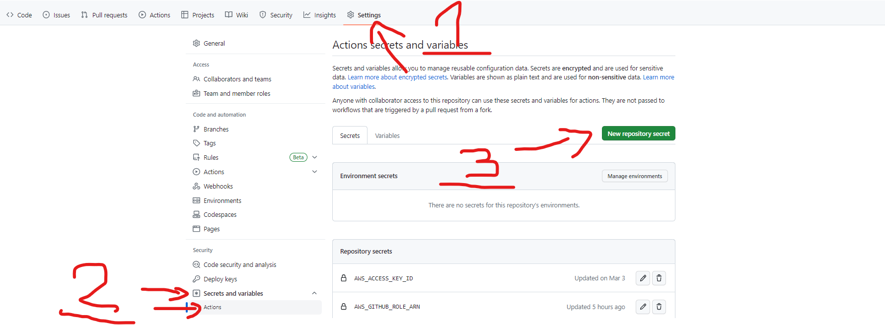
   4. Name the secret `AWS_GITHUB_ROLE_ARN` and paste the ARN in the value field </br> 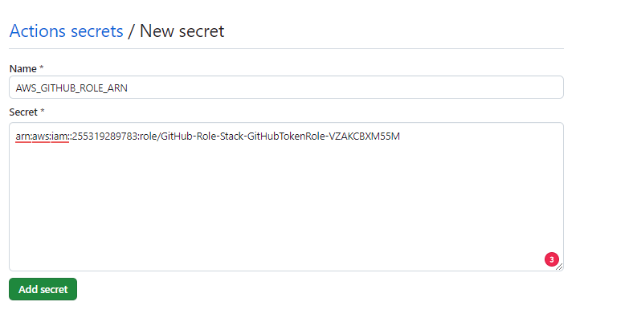
   5. Confirm by pressing 'Add secret' green button </br> 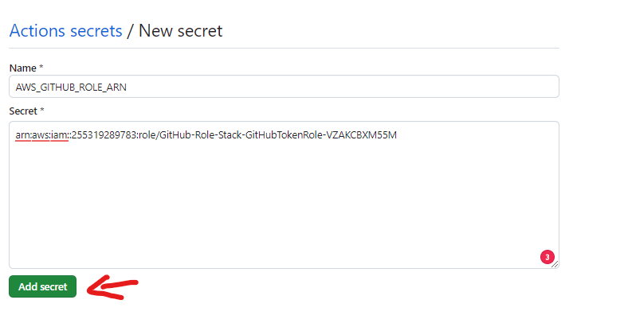 -->
