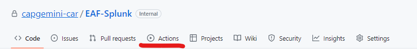
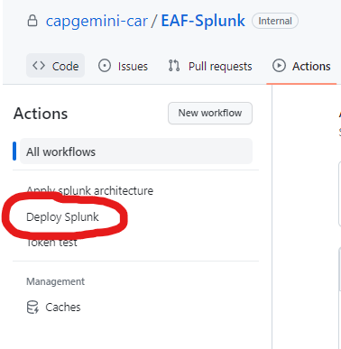
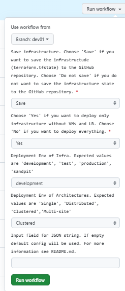
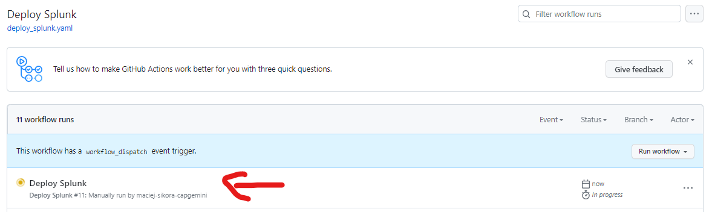
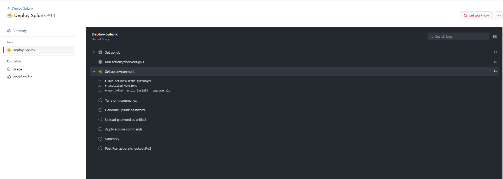
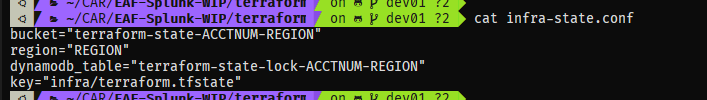
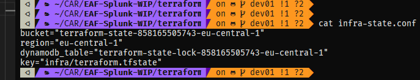

## Deployment HowTo

1. On your cloned/forked repository page on GitHub, navigate to `Actions` tab. 
   

2. One the left hand side navigate to 'Deploy Splunk' workflow. 
   

3. Click on `Run workflow` button.  

   1. If you want to save terraform files from infrastructure build, choose 'Save' in the first dropdown.
   2. In the second field pick 'No' if you want to deploy instances.
   3. In the third field pick the environment. The options
   are production, development, test and sandpit
   3. In the fourth field pick the topology, this is placeholder 
   for deployment types and is for future use.
   4. In the last field provide correct JSON file content or leave it empty. Default configuration will be chosen then. JSON creation process is described in the `Input JSON` section.
   5. After that press green button `Run workflow`.

4. Now you can follow the progress of the workflow.    
5. After a few second you shoud see logs from the workflow.  

## Troubleshooting

- The input JSON file is properly formatted and contains all required fields.
- setup local environment by setting & exporting the following variables

   <strong>
      AWS_ACCESS_KEY_ID                                    [ obtained from EAF SSO console]

      AWS_SECRET_ACCESS_KEY                                [ obtained from EAF SSO console]

      AWS_SESSION_TOKEN                                    [ obtained from EAF SSO console]

      AWS_DEFAULT_REGION                                   [ Region in which deployment is done]
      
      TF_VAR_env                                           [ Environment choice entered during deployment]
  </strong>

- Go into the relevant terraform directory & modify the backend config file to point to correct account

- Once the environment is set, you may modify the terraform code, plan and destroy.
